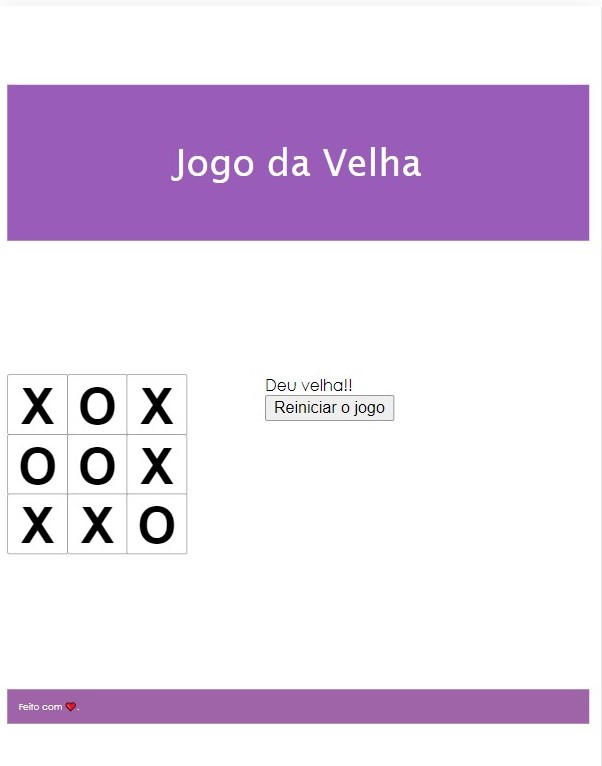

#   JOGO DA VELHA

 

## Descrição 📄

 Front-end web, desenvolvido em , do jogo da velha.

## Aplicação 💻

### Front-end

 
  
  
  
  

### Ambiente de Desenvolvimento

 
  

## Demo ✨

<h1 align = "center">
  
</h1>
